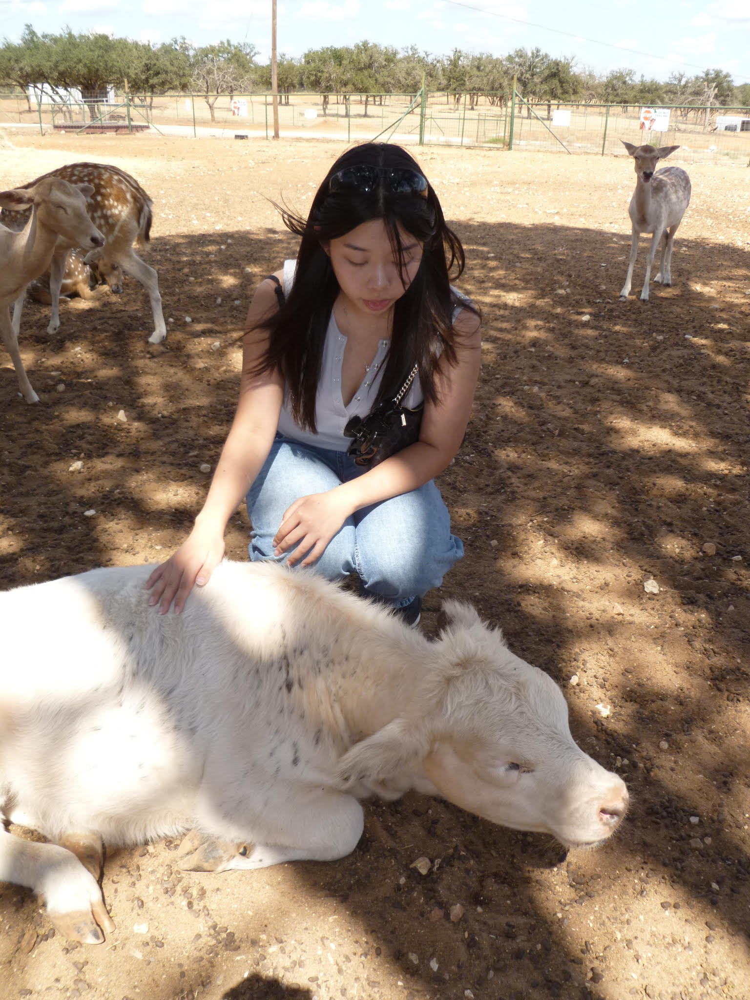

```{r setup, include=FALSE}
knitr::opts_chunk$set(echo = TRUE)
```
## Name: Cyndi

## Hello! Description 

My name is Cyndi and I am currently a senior. On campus I'm involved with the dance team and health programs. I really enjoy baking and trying new recipes with my friends in my free time. I am super close with my older sister. 

## GitHub Account
Here is my GitHub Account: 
[here](https://github.com/CyndiL105)

## Picture 
This is a picture of me petting a cow. 


## List of countries I've been to
- US 
- China 
- Dominican Republic 
- Canada 

## Build Time 
```{r, echo=FALSE}
Sys.time()
```

